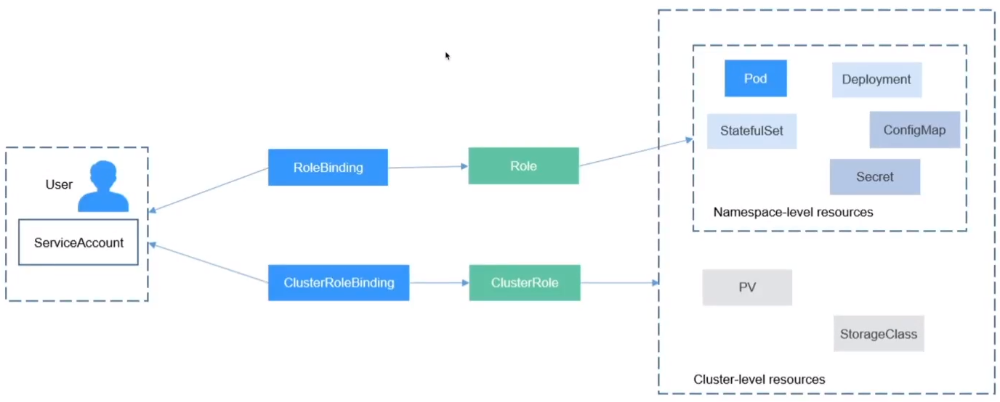

## RBAC
1. Role-based access control (RBAC)
- Là một cơ chế để quản lý và kiểm soát quyền truy cập trong một Kubernetes Cluster. Cho phép quản trị viên define các **Rule** và gán chúng cho **User** hoặc **Group** dùng để xác định quyền truy cập vào các tài nguyên trong Cluster
- RBAC được triển khai thông qua các thành phần chính: **Role**, **ClusterRole** và **RoleBindings**, **ClusterRoleBinding**.
- Role và ClusterRole định nghĩa các quyền truy cập cụ thể cho một tài nguyên như Pods, Services, Deployments và Namespaces.
- RoleBinding và ClusterRoleBindings được sử dụng để gán Role đã được định nghĩa, RoleBinding sẽ gán cho User còn ClusterRoleBinding gán cho Group
2. Mục đích sử dụng của RABC
- Quản trị viên có thể kiểm soát quyền truy cập của người dùng vào các tài nguyên khác nhau. Giúp đảm bảo mỗi người dùng chỉ có quyền truy cập vào các tài nguyên mà họ cần để thực hiện công việc của mình, đồng thời ngăn chặn truy cập trái phép hoặc không cần thiết đến các tài nguyên quan trọng.
- Cung cấp cơ chế linh hoạt và mạnh mẽ để quản lý quyền truy cập, giúp tăng cường bảo mật và kiểm soát trong môi trường Kubernetes

### Ngoài RBAC, Kubernetes còn hỗ trợ một số loại khác để quản lý quyền truy cập
- Attribute-based access control (ABAC): là một phương pháp quản lý quyền truy cập dựa trên các thuộc tính của đối tượng và ngữ cảnh. Trong Kubernetes, ABAC cho phép định nghĩa các quy tắc dựa trên các thuộc tính của người dùng, nhóm người dùng, tài nguyên và hành động để xác định quyền truy cập
- Webhook mode: cho phép tích hợp với các hệ thống quản lý quyền truy cập bên ngoài như OAuth, OpenID Connect. Khi được kích hoạt, Kubernetes sẽ gọi đến một webhook để kiểm tra và quyết định quyền truy cập dựa trên phản hồi từ webhook
- Node authorizer: là một plugin trong Kubernetes API Server, cho phép kiểm tra quyền truy cập dựa trên địa chỉ IP của Node trong Cluster. Khi một yêu cầu truy cập tới từ một Node, Node authorizer sẽ xác minh xem địa chỉ IP của Node đó có quyền truy cập vào tài nguyên được yêu cầu hay không
3. Các thành phần để setup Role-based access control (RABC)
Để thiết lập RABC trong Kubernetes, có các thành phần như sau:
- **Role**: là thành phần chính để định nghĩa các quyền truy cập cụ thể cho tài nguyên trong Kubernetes. Một Role định nghĩa tập hợp các quyền truy cập, được gắn liền với một namespace cụ thể
- **ClusterRole**: tương tự như Role, nhưng áp dụng trên toàn Cluster thay vì một namespace. Chúng được sử dụng để định nghĩa các quyền truy cập cho các tài nguyê không thuộc về namespace cụ thể
- **RoleBinding**: được sử dụng để liên kết Role với một đối tượng cụ thể và xác định quyền truy cập
- **ClusterRoleBinđing**: tượng tự như RoleBinding, nhưng áp dụng cho ClusterRole thay vì Roles. Chúng liên kết các ClusterRole với đối tượng cụ thể trong toàn bộ Cluster
### Trong Kubernetes RBAC, có 3 loại đối tượng cần xác thực:
- User: Là các tài khoản người dùng được tạo ra và quản lý bởi hệ thống xác thực của Kubernetes hoặc cơ sở dữ liệu xác thực ngoài. Có thể là người dùng hệ thống hoặc người dùng được tạo ra bởi người quản trị hệ thống.
- Group: Là tập hợp các người dùng được nhóm lại với nhau để chia sẻ các quyền truy cập với Role tương tự. Các nhóm có thể được tạo ra trong hệ thống xác thực của Kubernetes hoặc từ cơ sở dữ liệu xác thực bên ngoài
- Service Account: Là các tài khoản được tạo ra tự động và quản lý bởi Kubernetes. Chúng được sử dụng bởi các ứng dụng và các thành phần trong môi trường Kubernetes để xác thực và truy cập vào các tài nguyên
