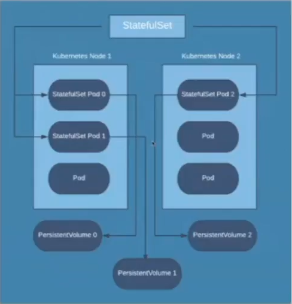
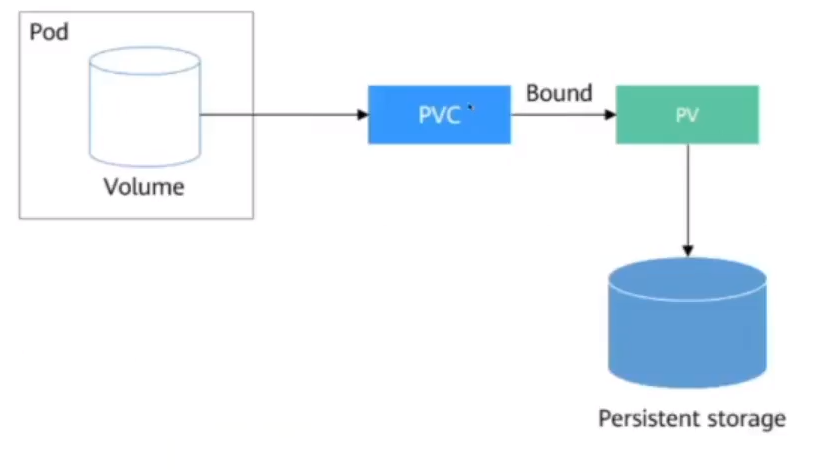

## Persistent Volume, Persistent Volume Claim, ConfigMap, Secret
> Volume là một Storage dùng dể lưu trữ dữ liệu của các container trong Pod. Nó giúp các container trong **cùng một Pod** **chia sẻ dữ liệu** hoặc **duy trì trạng thái**

> Một volume Kubernetes có thể được gắn vào một hoặc nhiều container trong Pod, cho phép chúng truy cập và chia sẻ dữ liệu. Volume **không phụ thuộc** vào **lifetime của container**, nghĩa là có thể tồn tại và được truy cập ngay cả khi container khởi động lại hoặc bị thay thế

Thường sử dụng với các data hay log khi ta có nhu cầu lưu trữ dữ liệu, tránh mất mát.

Trong Kubernetes có 2 loại: Volume lưu trữ tạm thời và vĩnh viễn:
- EmptyDir: cung cấp không gian lưu trữ tạm thời cho các container trong trùng một Pod và được xóa khi Pod kết thúc hoặc bị khởi động lại
- HostPath: cho phép truy cập vào tệp hoặc thu mục trên máy chủ host. Cho phép các container trong Pod truy cập và chia sẻ dữ liệu từ máy chủ Host (Tức là Node sở tại)
- Persistent Volume (PV)
- ConfigMap và Secret

1. Persistent Volume (PV)
- Sử dụng để lưu trữ data cho các Container trong Pod. Nó giúp tách biệt dữ liệu với Lifecycle của Pod, cho phép dữ liệu vẫn tồn tại sau khi Pod bị xóa hoặc khởi động lại.
- Có thể được tạo ra và quản lý bởi người quản trị hoặc tự động cấp phát bằng cách sử dụng Persistent Volume Provision, bằng cách sử dụng các tính năng của các bên cung cấp dịch vụ để có thể tự động tạo và quản lý Persistent Volume từ các nguồn lưu trữ như AWS EBC, Azure Disk, NFS, iSCSI, GlusterFS,...
- Một PV sẽ được binding (ràng buộc) với một Persistent Volume Claim nếu nó đáp ứng được các yêu cầu trong Persistent Volume Claim. Và mỗi Pod được setup thì sẽ được gắn với một Persistent Volume

2. Persistent Volume Claim (PVC)
- Là một yêu cầu để sử dụng một Persistent Volume với các yêu cầu cụ thể về dung lượng và các yêu cầu khác
- Khi tạo một PVC, người quản trị định nghĩa các yêu cầu của dung lượng lưu trữ, access mode và các thiết lập khác. PVC được liên kết với PV thông qua việc đảm bảo rằng các yêu cầu của nó phù hợp với các thuộc tính PV
- Khi một PV phù hợp với yêu cầu của PVC, PV sẽ được binding với PVC, tạo thành một liên kết động giữa PVC và PV. Sau khi PV và PVC được binding, PVC sẽ được mount vào Pod và các container trong Pod có thể sử dụng PV để lưu trữ và truy cập dữ liệu.
- Một PVC có thể được sử dụng bởi một hoặc nhiều Pod, nhưng chỉ có thể binding với một PV duy nhất tại một thời điểm. Nếu không có PV phù hợp với yêu cầu của PVC, PVC sẽ ở trạng thái Pending cho đến khi một PV phù hợp được tạo ra hoặc cung cấp.

- Để tăng tính an toàn cho Persistent Volume và Persistent Volume Claim, Kubernetes có hỗ trợ bằng cách thiết lập field accessMode trong file cấu hình YAML:
    - ReadWriteOnce: Chỉ một Node được phép truy cập Read-Write vào Storage này. Tuy nhiên cho phép nhiều Pod cùng một Node được quyền truy cập.
    - ReadOnlyMany: Cho phép nhiều Node được quyền truy cập với Read
    - ReadWriteMany: Cho phép nhiều Node được quyền truy cập với Read-Write.
3. ConfigMap
- ConfigMap là cơ chế để quản lý các thông tin cấu hình hoặc dữ liệu không nhạy cảm như biến môi trường, tệp cấu hình, hoặc dữ liệu khác mà ứng dụng cần truy cập.
- ConfigMap là một đối tượng Kubernetes, nằm trong phạm vi của một namespace cụ thể.
- ConfigMap chứa một tập hợp các cặp Key-Value, trong đó khóa là tên cấu hình và giá trị là dữ liệu cấu hình tương ứng
- Dữ liệu lưu trong ConfigMap có thể là tệp tin hoặc văn bản
4. Secret
- Là một đối tượng dùng để lưu trữ và quản lý thông tin bí mật như mật khẩu (password), khóa xác thực (authentication key), chứng chỉ (SSL/TLS) và dữ liệu nhạy cảm khác. Secrets được sử dụng để bảo vệ dữ liệu quan trọng trong môi trường Kubernetes và đảm bảo an toàn khi sử dụng
- Secrets được lưu trữ trong Kubernetes Cluster và có thể được sử dụng bởi các ứng dụng trong Pod. Các secret có thể được sử dụng như biến môi trường hoặc volume trong các Container.
- Kubernetes hỗ trợ các loại Secret như:
    - **Generic**: Secret Generic là loại Secret phổ biến nhất và cho phép bạn lưu thông tin bí mật bằng cách chỉ định các cặp Key-Value
    - **TLS**: Secret TLS được sử dụng để lưu trữ chứng chỉ SSL/TLS. Nó bao gồm các key, cert và các cấu hình liên quan để thiết lập kết nối bảo mật
    - **SSH**: Secret SSH chứa khóa SSH để truy cập từ xa vào các Pod trong Cluster.
    - **Opaque**: Opaque Secret cho phép lưu trữ các dữ liệu nhạy cảm trong dạng base64 encoded