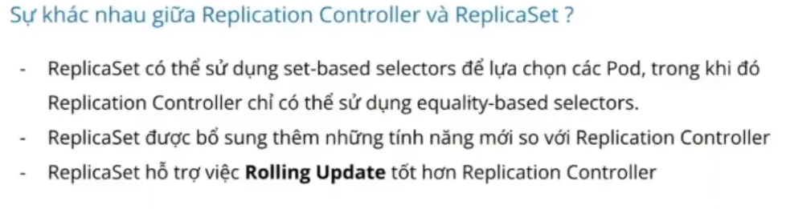
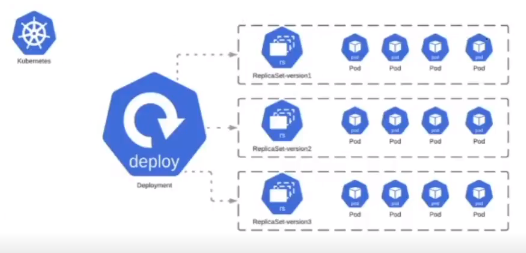
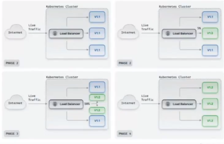
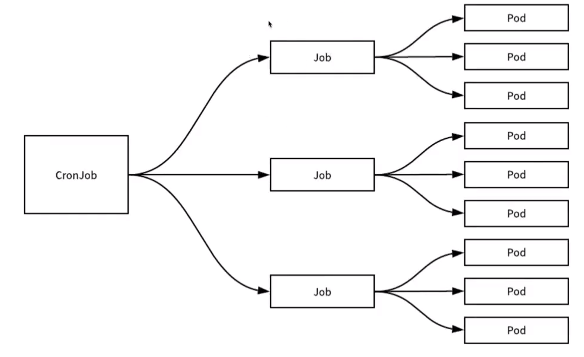

# Hello ban

## Các loại workload resource trong Kubernetes
- Workload Resource là các đối tượng được sử dụng để quản lý các Pod và định nghĩa cách Pod được triển khai
- Các Workload phổ biến trong Kubernetes bao gồm:
    - Replica Controller
    - ReplicaSet
    - Deployment
    - StatefullSet
    - DaemonSet
    - Job
    - CronJob
- Các workload được quản lý bởi c-m (Kubernetes Control Manager) được sử dụng để đảm bảo các Pod được chạy một cách chính xác
### 1. Replica Controller
- Sử dụng để quản lý số lượng replicas đang chạy của Pod, tạo hoặc xóa các Pod để đảm bảo số lượng luôn đúng với cấu hình của người quản trị
- Có khả năng tự phục hồi khi Pod xảy ra vấn đề và dừng hoạt động bằng cách tạo 1 Pod mới thay thế 
- Không hỗ trợ khả năng cập nhật số lượng Pod replicas hoặc scale-up hay scale-down
- Trong trường hợp nếu có Pod với label đã tồn tại thì nó sẽ tạo thêm số lượng tương ứng + Pod đã tồn lại match với label đó để tạo = total amount
### 2. Replica Set
- Là bản nâng cấp của Replica Controller và có thêm một số tính năng mới
- Hỗ trợ khả năng cập nhật số lượng Pod replicas hoặc scale-up hay scale-down
- Sử dụng selector để quản lý các Pod replicas
- Trong quá trình update phiên bản mới Replica Set sẽ tự động thay đổi container sử dụng trong Replica Set nhưng với các Pod thì nó vẫn sử dụng phiên bản cũ. Vì thế khi update phiên bản mới ta cần phải tạo 1 file version mới trước và run nó rồi mới được delete Pod cũ để tiện cho việc Rollback lại phiên bản cũ nếu xảy ra vấn đề

### 3. Deployment
- Là bản nâng cấp của ReplicaSet, khi tạo Deployment thì đồng thời nó cũng sẽ tạo ra 1 ReplicaSet để đảm bảo số lượng Pod luôn đúng với người quản trị chỉ định
- Deployment quản lý các ReplicaSet, ReplicaSet thì quản lý các Pod
- Có thể quản lý được version của Pod
- Có thể Rollback version nếu Pod ở version mới xảy ra vấn đề
- Các tính năng cập nhật bản sao (rolling-update), giữa các phiên bản (rollbacks) và giảm thời gian gián đoạn (zero-downtime)
[Rollout Command](https://jamesdefabia.github.io/docs/user-guide/kubectl/kubectl_rollout/)

**Deployment Strategy** trong Kubernetes là cách thức triển khai cập nhật các phiên bản mới của Pod trong Deployment
    - **Rolling Deployment** là một chiến lược triển khai ứng dụng trong Kubernetes, cho phép cập nhật phiên bản mới của ứng dụng theo cách **One by One**. Tức một Pod version cũ được xóa đi, sẽ có một Pod version mới được tạo ra. Vì thế **Rolling Deployment** giúp cho ứng dụng không bị downtime
    - **Recreate Deployment** là một chiến lược triển khai ứng dụng trong Kubernetes, trong đó tất cả các Pod sẽ được xóa đi và triển khai lại bằng các Pod mới. Vì thế, Application sẽ có một khoảng thời gian bị **downtime**. Nếu triển khai theo cách này ta nên chọn thời gian phù hợp để Update.
        - Được sử dụng trong trường hợp khi các tính năng của phiên bản mới khác hoàn toàn so với phiên bản cũ. Hiểu đơn giản là tại version cũ logic tính năng khác hoàn toàn so với version mới thì ta cần phải sử dụng **Recreate**
    - **Canary Deployment** là một chiến lược triển khai mà trong đó sẽ tạo ra một Pod version mới, thay vì chuyển toàn bộ traffic vào version mới, thì với phương pháp này sẽ chuyển **một phần traffic** để **đánh giá hiệu quả** của version mới. Sau quá trình đánh giá, nếu hiệu quả tốt có thể Rollout còn ngược lại có thể quay về version cũ

4. HPA (Horizontal Pod Autoscaler)
- Cho phép tự động điều chỉnh số lượng Pod replica dựa trên lưu lượng sử dụng tài nguyên của ứng dụng.
- Nó có chức năng giám sát việc sử dụng tài nguyên hoặc lưu lượng của ứng dụng từ đó tự động tăng giảm số lượng Pod replica để phù hợp với nhu cầu giúp tiết kiệm tài nguyên một cách tối đa.
### Ta có thể cài đặt tool [wrk](https://github.com/wg/wrk) bên trên để test request đến server để test xem

```shell
wrk -t12 -c400 -d30s http://127.0.0.1/
```
5. StatefullSet
* Statefull là nói đến các ứng dụng có trạng thái tức là khi ta xóa cái Pod đó thì không thể để data trong Pod đó xóa theo được mà cần lưu lại trạng thái của Data đó. Khi ta start lại thì cần đảm bảo được data trước đó vẫn còn thì đó được gọi là Statefull
* Stateless là nói đến các ứng dụng không cần có trạng thái như front-end hay các ứng dụng back-end bởi những request đi vào đều là nhưng request mới chưa phải là những request trước đó cần lưu lại để tiếp tục xử lý do đó gọi là Stateless
- Là một tài nguyên trong Kubernetes, cho phép triển khai và quản lý các ứng dụng statefull trong môi trường Kubernetes
- Cho phép triển khai các ứng dụng có trạng thái. VD: Database cần lưu trữ data trên Disk hoặc Memory
- Đảm bảo các Pod được tạo ra theo trình tự của chúng. VD: mysql-0, mysql-1,..
- Mỗi Pod tạo ra sẽ có một tên duy nhất của chúng không thay đổi. Điều này giúp ứng dụng có thể duy trì trạng thái của nó, đồng thời đảm bảo rằng các tài nguyên lưu trữ được sử dụng có thể chia sẻ giữa các Pod trong StatefullSet
- Quản lý ứng dụng dễ dàng, đảm bảo tính khả dụng và tin cậy trong môi trường của Kubernetes
- Thường setup theo dạng Headless Service. Tức là Service DB nào Write thì chỉ Write và ta sẽ trỏ thẳng tới nó chứ không qua Service nữa vì nếu một DB mà vừa Write vừa Read vừa Update thì nó chịu tải không nổi nên ta sẽ trỏ trực tiếp luôn mà không thông qua Service nữa.
- VD: 
    - Đối với database khi người ta scale hệ thống thì scale theo dạng Master-Slave
    - Tức là với Master người ta sẽ setup theo dạng chỉ Write, Update data
    - Còn với Slave thì sẽ chịu việc Read data từ database lên
6. DaemonSet
- Là tài nguyên trong Kubernetes, cho phép triển khai một replica của một Pod trên mỗi Node trong một Kubernetes Cluster.
- Mỗi Node trong Cluster sẽ chỉ có một bản sao và khi một Node mới được join vào Cluster thì một replica của Pod sẽ được triển khai tại Node đó
- Thường được sử dụng triển khai các ứng dụng hoặc công cụ mà cần phải chạy trên mỗi Node, chẳng hạn như **Logging** hoặc **Monitoring** (Prometheus, Grafana, ...)
- Điểm mạnh là tự động phân bổ tài nguyên Pod trên mỗi Node và luôn đảm bảo trên mỗi Node sẽ có một Pod
7. Job
- Là tài nguyên trong Kubernetes, cho phép triển khai và quản lý các công việc độc lập trong Cluster. Job giúp đảm bảo rằng các công việc được thực thi một lần duy nhất.
- Khi nhiệm vụ hoàn thành, Job sẽ dừng và không thực hiện lại
- Nếu muốn nó thực thi lại cần phải có cơ chế setup riêng
8. CronJob
- Là một tài nguyên trong Kubernetes, cho phép triển khai và quản lý các công việc định kỳ trong một Kubernetes Cluster
- Với CronJob, có thể đặt lịch thực hiện các công việc theo định kỳ ví dụ như Backup dữ liệu, chạy các bản cập nhật hệ thống hoặc thực hiện các tác vụ tính toán định kỳ. Các Job sẽ được tạo ra và thực thi.
- Để thiết lập thời gian định kỳ cho CronJob, người quản trị viên cần sử dụng field schedular và bao gồm các thành phần như: phút, giờ, ngày, tháng và các ngày trong tuần.

